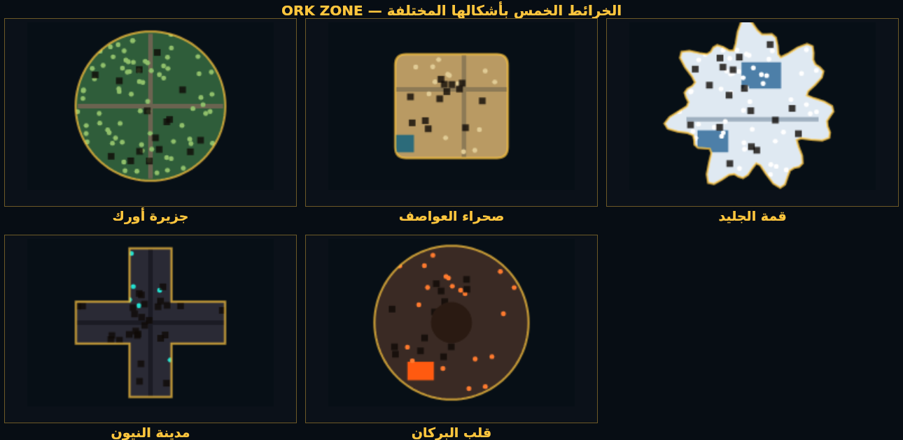

# ⚔️ أورك زون — ORK ZONE

> لعبة **باتل رويال** عربية كاملة (أونلاين + أوفلاين) بأسلوب **بابجي** و **فري فاير**:
> ٥٠ لاعباً، ٥ خرائط بأشكال مختلفة، ١٨ سلاحاً، ١٢ مقاتلاً بمهارات خاصة، اسكنات أسطورية،
> عملات ومتجر وباس معركة ومهام وأصدقاء وغرف خاصة بالرمز — كل شيء داخل المتصفح، بلا أي تنزيل.



---

## 🎮 المميزات الكاملة

### 🕶️ عرض ثلاثي الأبعاد بمنظور الشخص الأول (جديد!)
اللعبة الآن **ثري دي من منظور الشخص الأول** بمحرك مجسّم مكتوب من الصفر (Rasterization برمجي على
Canvas — بلا أي مكتبات خارجية): إسقاط منظوري حقيقي، قصّ عند المستوى القريب، ترتيب بالعمق،
تظليل بضوء شمس وضباب مسافة، سماء وشمس وسلاسل أفق، بيوت بأسقف وجدران مجسّمة، أشجار وصخور
ومركبات ثلاثية الأبعاد، نموذج سلاح بين يديك مع ارتداد ومنظار قنص، وهبوط بالمظلة يُرى بالعالم.

- **منظور الشخص الأول (افتراضي)**: انقر داخل المباراة لقفل المؤشر وحرّك الماوس للنظر، `Esc` لفكّه.
- **منظور الشخص الثالث**: الكاميرا خلف مقاتلك مع تجنّب الجدران — ترى جسمك كاملاً.
- **الوضع الكلاسيكي ثنائي الأبعاد** من الأعلى ما زال متاحاً لمن يفضّله.
- بدّل المنظور من: **الإعدادات ← منظور اللعب** (يُحفظ اختيارك).
- على الهاتف: اسحب يمين الشاشة للنظر حولك.

### 🧍 أشكال اللاعبين المضبوطة
بدل الدوائر المسطّحة، كل مقاتل الآن **جسم بشري متناسق**: رأس بملامح أزياء (خوذة/قبعة/تاج/قلنسوة)،
جذع بدرع وحقيبة، ذراعان تمسكان السلاح فعلياً، ساقان تمشيان بدورة مشي، وظل على الأرض —
مع وضعيات الانحناء والاستلقاء والإصابة والسقوط، ومستويات تفاصيل (LOD) تحافظ على الأداء،
وأجسام حقيقية تظهر في المنظور ثلاثي الأبعاد وبورتريهات القائمة كما هي.

### أوضاع اللعب
| النمط | الوصف |
|---|---|
| **فردي (Solo)** | أنت وحدك ضد ٤٩ لاعباً — آخر من يقف يفوز (بويـه! 🍗) |
| **ثنائي (Duo)** | زميل واحد، إحياء الزملاء المصابين ومعارك الفرق |
| **رباعي (Squad)** | فريق من ٤ مقاتلين، تعشيق + إحياء + استراتيجية |
| **معركة الفريق (TDM)** | ساحة قتال ٤ ضد ٤ بلا عاصفة، إعادة إحياء فورية، أول فريق يصل ٣٠ إقصاء |

- **أونلاين حقيقي**: غرف على السيرفر مع مطابقة لاعبين، غرفة خاصة برمز من ٤ أرقام، دردشة، وبوتات تُكمل المباراة.
- **أوفلاين كامل**: نفس اللعبة تماماً بمحاكاة محلية (٣٠+ بوتاً) حتى بدون إنترنت — والجوائز تُحفظ في حسابك.
- **مشاهدة بعد الموت**: الكاميرا تتبع زميلك الحي حتى نهاية المباراة.

### الأرض والخرائط (٥ أشكال مختلفة فعلياً)
| الخريطة | الشكل | الطابع |
|---|---|---|
| 🏝️ **جزيرة أورك** | دائرة | غابات كثيفة، بلدات قديمة، نهر يقسم الخريطة |
| 🏜️ **صحراء العواصف** | مستطيل مستدير | مدن ملحية، كثبان، مدى رؤية بعيد للقنّاصة |
| ❄️ **قمة الجليد** | نجمي غير منتظم (Blob) | بحيرات متجمدة، أكواخ جبلية، أرض زلقة |
| 🌃 **مدينة النيون** | صليبي | ناطحات سحاب وشوارع مضاءة — قتال شوارع |
| 🌋 **قلب البركان** | حلقة | بحيرة حمم قاتلة في المنتصف تحرق كل من يقترب |

كل خريطة: مباني بأبواب، طرق، مياه، أشجار، صخور، صناديق قابلة للتدمير، ديكور داخلي،
نقاط ساخنة للهبوط (Hot Drops)، مركبات، وغنائم موزّعة.

### الأسلحة (١٨) والملحقات
- **مسدسات**: بي ٩٢ · صحراء الصقر (Deagle)
- **رشاشات**: إم بي ٤٠ · UMP45 · الناقل (Vector)
- **بنادق هجومية**: AKM · M416 · SCAR-L · جروزا
- **قناصة**: SKS · Kar98k · **AWM** (إنزال جوي فقط)
- **خرطوش**: M1014 · SPAS-12 · **رشاش ثقيل** M249 · **المنجل الدوار Minigun** (خرافي)
- **قتال قريب**: المنجل والمقلاة (تصد الطلقات من الخلف!)
- **ملحقات**: منظار ٢×/٤×/٨× · قبضة · مخزن موسع · كاتم صوت · موازن ارتداد
- **دروع**: خوذة/درع مستوى ١-٣ + حقائب ١-٣ (سعة ذخيرة أكبر)

### القتال والفيزياء
رصاص بسرعة حقيقية مع فحص المسار كاملاً (لا يمر من الأعداء ولا من الجدران)، إصابات رأس ×٢.١،
ارتداد وتشتت متغيّر (وضع الوقوف/الانحناء/الاستلقاء، التصويب، الجري)، دروع تمتص الضرر،
قنابل يدوية ودخان، عاصفة تتقلص على ٨ مراحل بضرر متزايد، إنزال جوي بغنائم أسطورية،
مركبات (جيب · دراجة · قارب · مدرعة) بالدهس والانفجار، وحمم بركانية تذيب الجميع.

### الشخصيات (رجال فقط — بلا نساء) والاسكنات الأسطورية
١٢ مقاتلاً، كل واحد بمهارة فعّالة داخل اللعبة:
| الشخصية | الندرة | المهارة |
|---|---|---|
| فهد الصحراء · الرقيب عامر | عادي | سرعة جري · تعبئة أسرع |
| د. حكيم · الظل خالد | نادر | شفاء ميداني · تلاشي عن الرادار |
| القناص شادي · المهندس رامي · الصخرة زيد | ملحمي | دقة عند التصويب · حصن واقٍ · تحمل ضرر |
| النينجا ياسر · المجهول · تنين الرمال · أسد الجليد | أسطوري | انطلاقة برق · ترس إضافي · زفير النار · تجميد |
| **ملك أورك** 👑 | **خرافي** | كل المهارات + هالة ذهبية |

**٢٠ اسكن** بتأثيرات بصرية حقيقية (لهب، جليد، برق، فراغ، تاج، دخان، تشويش، انطلاقة) + أزياء خاصة
لكل شخصية + أزياء أسلحة (٧) + مظلات (٤) + رقصات (٥). الندرات: عادي → نادر → ملحمي → أسطوري → **خرافي**.

### العملات والمتجر
- 🪙 **الذهب** (شراء الأزياء/الأسلحة/الصناديق) و 💎 **الجواهر** (الندرات الأسطورية والعجلة والباس).
- **متجر كامل**: عروض · حزم · شخصيات · اسكنات · أسلحة · مركبات · **صناديق حظ بنِسب معلنة** · **عجلة حظ**.
- **باس المعركة**: ٥٠ مستوى × مسارين (مجاني + مميز) بجوائز حتى شخصية «ملك أورك».
- **المهام والإنجازات**: يومية (تُصفَّر كل يوم) · أسبوعية · إنجازات دائمة.
- **مكافأة الدخول اليومية** بسلسلة تصل ٧ أيام.
- **لوحة الأبطال**: الإقصاءات · الانتصارات · الضرر. **الأصدقاء**: إضافة بالإسم.

### واجهة اللعب (HUD)
ميني ماب بشاشة العاصفة والدائرة القادمة · كومباس · شاشة القتل (Kill Feed) · مؤشرات إصابة ورأس
· أرقام ضرر طائرة · شريط صحة/درع/طاقة · أسلحتك وذخيرتك وعتادك وأدواتك · لوحة نتائج حيّة (Tab)
· مؤشرات اتجاه الطلقات · اهتزاز كاميرا ووميض ضرر · حالة المهارة وأزرار اللمس للهاتف.

---

## 🚀 التشغيل

```bash
npm install        # تنزيل المكتبات (express + ws)
npm start          # تشغيل السيرفر
# افتح المتصفح على:  http://localhost:3000
```

ثم: اكتب اسمك ← «ابدأ اللعب فوراً» ← اختر **🌐 أونلاين** أو **📴 أوفلاين** ← النمط والخريطة ← اقفز 🪂.

> لتثبيت خفيف بلا أدوات الاختبار: `npm install --omit=dev`

> **شاشة التحميل لا تعلق أبداً**: اللعبة محلية ١٠٠٪ — لا خطوط ولا مكتبات من أي CDN، لذلك لا
> تنتظر شاشة التحميل أي شبكة خارجية. الخطوط (Cairo و Orbitron) مضمّنة في `public/fonts/`.
> وحتى لو فشل تحميل ملفات اللعبة أو تعطّل التمهيد، فإن مُراقباً مبكراً داخل `index.html` يُنهي
> شاشة التحميل خلال ٥ ثوانٍ ويعرض شاشة الدخول مع رسالة وزر «إعادة المحاولة».

### المشاركة مع الأصدقاء (أونلاين)
1. السيرفر يفتح المنفذ **3000** — شارك رابط الشبكة/الاستضافة معهم.
2. **غرفة بالأصدقاء** ← يُنشأ رمز من ٤ أرقام ← أعطهم الرمز ← يدخلون من «انضمام برمز».
3. أو اترك «لعب أونلاين» ليطابقك السيرفر تلقائياً مع من يلعب الآن.

## 🎯 التحكم

| كمبيوتر | الوظيفة | هاتف |
|---|---|---|
| `W A S D` | الحركة (نسبةً لاتجاه نظرك) | عصا التحكم على اليسار |
| تحريك الماوس | النظر حولك (بعد قفل المؤشر بالنقر) | اسحب يمين الشاشة |
| `Esc` | فك قفل المؤشر / إيقاف مؤقت | — |
| زر الماوس الأيسر | إطلاق النار (اضغط باستمرار) | زر 🔥 |
| زر الماوس الأيمن | تصويب دقيق (منظار) | زر 🎯 |
| `Shift` | جري سريع | إسحب العصا للنهاية |
| `C` / `Z` | انحناء / استلقاء | زر ⬇️ |
| `R` | إعادة تعبئة | زر 🔄 |
| `F` | التقاط الغنائم القريبة | زر 🎒 |
| `E` | ركوب/خروج مركبة | زر 🚙 |
| `Q` | المهارة الخاصة | زر ✨ |
| `H` | تبديل العلاج | زر 💊 |
| `G` | قنبلة/دخان | — |
| `1` / `2` / `3` | السلاح الأول/الثاني/قريب | زر 🔀 |
| `M` | الرقصات | — |
| `Tab` | لوحة النتائج | — |
| `X` | إحياء زميل مصاب | زر ✋ |

---

## 🧱 البنية

```
server/
  index.js      السيرفر: REST (حسابات/متجر/مهام/نتائج) + WebSocket (/ws) + ملفات اللعبة
  rooms.js      الغرف، المطابقة، الدورة اللعبة (30Hz)، البوتات، اللقطات (20Hz)، الجوائز
  accounts.js   الحسابات: مستويات، عملات، متجر، صناديق، عجلة، باس، مهام، مكافأة يومية، ترتيب

shared/         ← نفس الكود يعمل على السيرفر وفي المتصفح
  gamedata.js   كل بيانات اللعبة (أسلحة، ملحقات، شخصيات، اسكنات، خرائط، عاصفة، غنائم، متجر…)
  sim.js        محرك المحاكاة: توليد الخرائط بأشكالها، فيزياء، رصاص/مسار، ضرر، عاصفة، مركبات، غنائم
  ai.js         ذكاء البوتات: هبوط، تسليح، قتال بالتفويت، علاج، إحياء، قيادة، ملاحقة أصوات الطلقات

public/
  index.html    كل الشاشات (تحميل، دخول، قائمة، خزنة، متجر، باس، مهام، ترتيب، غرفة، HUD، نتائج)
                + مُراقب تحميل مبكر (Fail-safe) يمنع بقاء شاشة التحميل عالقة
  css/style.css تصميم أسطوري ذهبي RTL مع استجابة كاملة للهاتف
  css/fonts.css تصريحات @font-face محلية (font-display: swap)
  fonts/        ملفات الخطوط woff2 (Cairo + Orbitron) — بلا أي CDN
  js/main.js    التمهيد وربط كل شيء
  js/game.js    إدارة المباراة (أوفلاين: محاكاة محلية / أونلاين: لقطات + توقع محلي) + HUD
  js/render.js  مدير الرسم: يختار المحرك ثلاثي الأبعاد أو ثنائي الأبعاد + الميني ماب والمؤثرات
  js/render3d.js محرك ثلاثي الأبعاد بلا مكتبات: إسقاط منظوري، ترتيب عمق، تظليل وضباب،
                 نماذج لاعبين بشرية، سلاح منظور أول، عاصفة مجسّمة، LOD وجسيمات
  js/ui.js      القوائم والمتجر والخزنة والباس + رسم بورتريهات الشخصيات + معاينة الخرائط
  js/audio.js   محرك صوت مُركّب بالكامل (WebAudio) — بلا ملفات صوتية خارجية
  js/input.js   لوحة مفاتيح + ماوس + لمس/عصا تحكم
  js/net.js     WebSocket + REST

tests/          اختبارات شاملة (٢٥ منطق + ٢٣ تحميل + ٣٣ رسم ثلاثي الأبعاد + ٥٦ عميل + ٢١ أونلاين)
tools/          أدوات: معاينة PNG للعبة
```

### كيف تعمل المحاكاة الأونلاين؟
السيرفر هو المرجع (**authoritative**): يستقبل مدخلات اللاعبين ٣٠ مرة/ثانية، يخطو المحاكاة، ويبث
لقطة ٢٠ مرة/ثانية. اللاعب يرى حركته فوراً عبر **توقع/تنعيم محلي**، والآخرون يتحركون بتداخل ناعم
(Interpolation). توليد الخرائط **حتمي** من بذرة المباراة، فيرى الجميع نفس العالم دون تحميل ملايين
البيانات: تُرسل الغنائم الأساسية مرة واحدة والجديدة فقط عبر الأحداث.

---

## ✅ الاختبارات

```bash
npm test               # ٢٥ اختبار منطق: خرائط، سلاح، بوتات، عاصفة، رصاص، مركبات، أداء، REST
npm run test:loading   # ٢٣ اختبار لشاشة التحميل: لا CDN، كل الموارد مخدومة، المراقب المبكر، طبقة التدوير
npm run test:render    # ٣٣ اختبار للمحرك ثلاثي الأبعاد: إسقاط، نسب اللاعبين، LOD، الخرائط الخمس، أداء
npm run test:client    # ٥٦ اختبار عميل: DOM حقيقي (jsdom) + انتهاء شاشة التحميل + تشغيل ١٤٠٠ إطار رسم على ٥ خرائط
npm run test:online    # ٢١ اختبار أونلاين: عميلان WebSocket حقيقيان، لقطات، إقصاء، جوائز
npm run test:all       # الكل (يحتاج السيرفر مشغّلاً لاختبار الأونلاين)
npm run previews       # توليد صور PNG للعبة (منظور أول/ثالث) في مجلد previews/
```

حالة الاختبارات الحالية: **٢٥/٢٥** منطق · **٢٣/٢٣** تحميل · **٣٣/٣٣** رسم ٣D · **٥٦/٥٦** عميل · **٢١/٢١** أونلاين — بلا أي خطأ.

## 📸 صور من اللعبة
في مجلد `previews/`: معارك الخرائط الخمس **بمنظور الشخص الأول**، منظور الشخص الثالث،
الهبوط بالمظلة ثلاثي الأبعاد، اصطفاف المقاتلين بأجسامهم الجديدة، الشخصيات باسكناتها، وأشكال الخرائط.

## 🛠️ ملاحظات تقنية
- **صفر اعتماديات على الإنترنت وقت اللعب**: الرسم ثلاثي الأبعاد برمجي على Canvas 2D (بلا WebGL/مكتبات)، والصوت مُركّب بـ WebAudio (لا ملفات).
- **صفر طلبات خارجية في الصفحة**: لا `<link>` ولا `<script>` لأي مضيف خارجي — كان رابط خطوط Google
  يحجب العرض (render-blocking) فيوقف تنفيذ كل السكربتات وتبقى شاشة التحميل عالقة على الشبكات
  التي تحجب/تُبطئ Google. الآن الخطوط محلية، وأي عطل يُنهي شاشة التحميل تلقائياً برسالة واضحة.
- **طبقة «دوّر الجهاز»** تظهر فقط لأجهزة اللمس العمودية، ويمكن تجاوزها بزر «متابعة على أي حال»
  (نافذة الكمبيوتر القصيرة لم تعد تُعامل كهاتف).
- **يعمل على الهاتف** بأزرار لمس وعصا تحكم، وعلى الكمبيوتر بالماوس ولوحة المفاتيح.
- **بيانات الحسابات** تُحفظ في `data/accounts.json` (يمكن استبداله بقاعدة بيانات).
- **أداء**: محاكاة ٤٠ بوتاً تستهلك أقل من ٥٪ من الزمن الحقيقي، ويمكن تشغيل عدة غرف على نفس السيرفر.
- إن انقطع اللاعب أثناء المباراة يتحوّل تلقائياً إلى بوت حتى تستمر المباراة للبقية.

## 📄 الترخيص
MIT — العب، طوّر، وأضف ما تشاء. صُنع بـ ❤️ — **أورك زون**.
