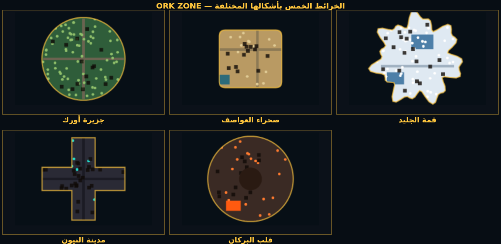

# ⚔️ أورك زون — ORK ZONE

> لعبة **باتل رويال** عربية كاملة (أونلاين + أوفلاين) بأسلوب **بابجي** و **فري فاير**:
> ٥٠ لاعباً، ٥ خرائط بأشكال مختلفة، ١٨ سلاحاً، ١٢ مقاتلاً بمهارات خاصة، اسكنات أسطورية،
> عملات ومتجر وباس معركة ومهام وأصدقاء وغرف خاصة بالرمز — كل شيء داخل المتصفح، بلا أي تنزيل.



---

## 🎮 المميزات الكاملة

### 🕶️ عرض ثلاثي الأبعاد بمنظور الشخص الأول (جديد!)
اللعبة الآن **ثري دي من منظور الشخص الأول** بمحرك مجسّم مكتوب من الصفر (Rasterization برمجي على
Canvas — بلا أي مكتبات خارجية): إسقاط منظوري حقيقي، قصّ عند المستوى القريب، ترتيب بالعمق،
تظليل بضوء شمس وضباب مسافة، سماء وشمس وسلاسل أفق، بيوت بأسقف وجدران مجسّمة، أشجار وصخور
ومركبات ثلاثية الأبعاد، نموذج سلاح بين يديك مع ارتداد ومنظار قنص، وهبوط بالمظلة يُرى بالعالم.

- **منظور الشخص الأول (افتراضي)**: انقر داخل المباراة لقفل المؤشر وحرّك الماوس للنظر، `Esc` لفكّه.
- **منظور الشخص الثالث**: الكاميرا خلف مقاتلك مع تجنّب الجدران — ترى جسمك كاملاً.
- **الوضع الكلاسيكي ثنائي الأبعاد** من الأعلى ما زال متاحاً لمن يفضّله.
- بدّل المنظور من: **الإعدادات ← منظور اللعب** (يُحفظ اختيارك).
- على الهاتف: اسحب يمين الشاشة للنظر حولك.

### 🌟 ترقية جودة العالم واللاعبين (الأحدث)
- **نموذج إضاءة من ثلاث مكوّنات**: شمس مباشرة + ضوء سماء من نصف الكرة + ارتداد من الأرض،
  مع لمعة خفيفة (Specular) على الأسطح المواجهة للشمس. الظلال لم تعد رمادية ميتة بل تميل
  للون سماء الخريطة (أزرق في الجليد، برتقالي في البركان).
- **تدرّج إضاءة أنعم** (٢٤ درجة بدل ١٤) فاختفت أشرطة التدرّج على الجدران والمجسمات.
- **غطاء أرضي حيّ**: تمويج لوني طبيعي للتربة + خصل عشب/شجيرات + حصى صغيرة حول اللاعب،
  كلها مولّدة من تجزئة الإحداثيات (ثابتة المكان، بلا ذاكرة إضافية) وداخل حدود الخريطة فقط.
- **ضباب أرضي عند الأفق**: الأرض البعيدة تذوب في لون الأفق فيزداد الإحساس بالعمق والمسافة.
- **ظلال ناعمة متدرّجة الحواف** بدل البقع السوداء الصلبة — ومفعّلة الآن حتى في الجودة المتوسطة والمنخفضة.
- **واجهات مباني بتفاصيل**: قاعدة حجرية + نوافذ غائرة بإطارات + حافة سقف — تكسر الجدران المسطّحة وتعطي مقياساً.
- **صخور أدقّ** (٩ أضلاع في الفائقة) بقمم تأخذ لون البيئة (طحلب/ثلج/سخام).
- **لاعبون أكثر تفصيلاً**: رقبة، كتفان، حزام، ركبتان، أحذية برقبة ونعل، جيوب مخازن على الصدر،
  أحزمة الحقيبة، حافة الخوذة وواقي الوجه، ووجه بملامح (عينان وفم) وشعر خلفي أغمق —
  مع تظليل مختلف لكل جهة من الجسم فيبدو مجسّماً لا صندوقاً.
- الأداء بقي ضمن الحدّ: الجودة المنخفضة (الهواتف الضعيفة) لم تتأثر تقريباً، والحاكم التلقائي
  للجودة ما زال يضبط الدقة لحظياً حسب معدل الإطارات.

### ✨ تحديث المحرك ثلاثي الأبعاد
- **طقس حيّ لكل خريطة**: مطر مائل في **مدينة النيون** · ثلج متطاير في **قمة الجليد** ·
  جمرات صاعدة متوهّجة في **قلب البركان** · عواصف غبار أفقية في **صحراء العواصف** ·
  حبوب لقاح تسبح في هواء **جزيرة أورك** — جسيمات مجسّمة تتبع الكاميرا وتُقصّ بالعمق.
- **غيوم إجرائية** تنساب في السماء مع الشمس والنجوم وسلاسل الأفق.
- **ظلال أرضية ناعمة** تحت اللاعبين والمركبات والأشجار والصخور (تخفت كلما ارتفعت بالمظلة).
- **إضاءة ديناميكية**: وميض فوهة السلاح والانفجارات ينير المشهد فعلياً (Additive Light).
- **تعتيم أطراف سينمائي (Vignette)** يركّز النظر بلا تكلفة أداء.
- **مجال رؤية رأسي أوسع** (±٣٥° بدل ±٢٤°) — تنظر لأعلى المباني وأسفل المنحدرات.
- **ركلة مجال الرؤية عند الجري** مع **خفض السلاح وميلانه** أثناء العدو.
- كل ذلك ما زال أسرع من ٣٠ إطاراً/ثانية في اختبار الأداء (≈١٢ms للإطار على الجودة العالية).

### 📱 اللعب بالعرض (Landscape) على الهاتف — تخطيط احترافي
**اللعبة لا تعمل عمودياً إطلاقاً على أي جهاز**: أي شاشة عمودية (هاتف/تابلت/نافذة ضيقة)
تُحجب بطبقة ملء الشاشة **بلا زر تجاوز**، وتُجمَّد حلقة اللعب كلياً حتى يدور الجهاز.
عند أول لمسة تُحاول اللعبة **قفل الاتجاه أفقياً + ملء الشاشة تلقائياً** (أندرويد)،
وعند تثبيتها كتطبيق (PWA) يفرض الـ manifest الوضع الأفقي من أول التشغيل.
تخطيط التحكم صُمّم للإبهامين كما في بابجي/فري فاير:

| المنطقة | الوظيفة |
|---|---|
| يسار أسفل | **عصا حركة عائمة** تظهر تحت إبهامك أينما لمست (وليست مثبّتة في زاوية) |
| يمين الشاشة | **سحب للنظر** بتعدد لمسات — يعمل أثناء الرمي في نفس الوقت |
| زر الرمي الكبير | اضغط للرمي، و**اسحب من الزر نفسه لتصويب النظر** بإصبع واحد |
| عنقود أسفل اليمين | رمي 🔥 + تصويب 🎯 + قفز · انحناء · استلقاء · تعبئة حولهما |
| عمود يمين (٢×٣) | التقاط · علاج · قنبلة · مهارة · تبديل سلاح · مركبة — فوق العنقود مباشرة |
| أسفل الوسط | **صناديق الأسلحة والذخيرة** وفوقها أشرطة الصحة/الدرع/الطاقة — بعيداً عن الإبهامين |
| أعلى اليسار | النتائج 📊 + ملء الشاشة ⛶ (تحتها سجل الإقصاءات) |
| زر رمي إضافي | على الحافة اليسرى لمن يرمي بالإبهام الأيسر |

- **مساعدة تصويب** لطيفة عند التصويب/الرمي باللمس (تُطفأ من الإعدادات).
- **اهتزاز خفيف** عند الضغط، و**حساسية نظر لمس** مستقلة عن حساسية الماوس.
- **الجري تلقائياً** عند دفع العصا للأقصى، ويتوقف فور الرمي أو التصويب.
- الأحجام كلها بوحدات `vh` متكيّفة (تعمل من ٣٢٠ بكسل ارتفاعاً حتى التابلت)
  وتحترم حواف الشاشات المنحوتة (safe-area)، وفراغات العنقود لا تبتلع لمسة النظر.

### ⚡ الأداء على كل الأجهزة (ضعيف ٣٠fps → قوي ١٢٠fps)
- **الجودة «تلقائي»** هي الافتراضية: تكتشف قوة الجهاز (الأنوية + الذاكرة + دقة الشاشة)
  وتبدأ من الدرجة المناسبة، ثم **تراقب معدل الإطارات لحظياً**:
  أقل من ~٢٧fps → تنزل درجة كاملة؛ أعلى من ~٥٥fps بثبات → تصعد درجة حتى حد الجهاز.
- **مقياس دقة تكيّفي** داخل كل درجة (حتى ٠٫٥ على الأجهزة الضعيفة جداً) + مسافة رسم تكيّفية.
- الفيزياء والمحاكاة **مستقلة عن معدل الإطارات** (dt) — ٣٠fps تلعب بنفس سرعة ١٢٠fps.
- **عدّاد FPS مدمج** في الـ HUD يتلوّن (أخضر/أصفر/أحمر) لترى الأداء بعينك.
- حد الجسيمات والطقس والغيوم والأشجار يتبع الدرجة — الأجهزة الضعيفة ترى مشهداً أخف
  بلا أن تختفي اللاعبون أو الأساسيات.

### 🧍 أشكال اللاعبين المضبوطة
بدل الدوائر المسطّحة، كل مقاتل الآن **جسم بشري متناسق**: رأس بملامح أزياء (خوذة/قبعة/تاج/قلنسوة)،
جذع بدرع وحقيبة، ذراعان تمسكان السلاح فعلياً، ساقان تمشيان بدورة مشي، وظل على الأرض —
مع وضعيات الانحناء والاستلقاء والإصابة والسقوط، ومستويات تفاصيل (LOD) تحافظ على الأداء،
وأجسام حقيقية تظهر في المنظور ثلاثي الأبعاد وبورتريهات القائمة كما هي.

### 🕌 حارس مواقيت الصلاة (جديد!)
نظام كامل مدمج في اللعبة يحسب **مواقيت الصلاة فلكياً على جهازك** (بلا إنترنت وبلا أي خدمة خارجية):

- عند دخول وقت **الظهر أو العصر أو المغرب أو العشاء** → **تتوقّف اللعبة فوراً** بطبقة قفل
  لا يمكن تجاوزها (تجميد كامل للمباراة، لا حركة ولا إطلاق ولا استئناف بزر الإيقاف).
- يُسأل اللاعب: **«هل صليت؟»** — باختياره: `نعم صليت` أو `لا، لم أصلِّ بعد`.
- **نعم** → يُفتح القفل وتعود المباراة من حيث توقفت تماماً.
- **لا** → **تُغلق اللعبة** (إنهاء المباراة والعودة للقائمة) و**تُفتح الكاميرا** ويُطلب من اللاعب
  أن يصوّر نفسه وهو يصلي، ولا يُفتح القفل إلا بعد التقاط الصورة واعتمادها.
- القفل **يصمد أمام إعادة تحميل الصفحة** وأمام تعطيل الحارس من الإعدادات (التزام الصورة لا يسقط).
- الصور تُحفظ **على جهازك فقط** (localStorage) في سجل «إثبات الصلاة» — لا تُرفع لأي سيرفر.
- صفحة **🕌 مواقيت الصلاة** في القائمة: مواقيت اليوم، عدّاد الصلاة القادمة، ٤٠ مدينة جاهزة،
  ٧ طرق حساب (أم القرى · الخليج · رابطة العالم الإسلامي · المصرية · كراتشي · ISNA · طهران)،
  مذهب العصر (الجمهور/الحنفي)، تحديد الموقع تلقائياً أو إحداثيات يدوية، وخيار إضافة الفجر للحارس.
- عند أول تشغيل تُخمَّن المدينة من المنطقة الزمنية للجهاز.

### 🔫 أصوات أسلحة واقعية واحترافية (جديد!)
أُعيدت هندسة محرك الصوت بالكامل — كل طلقة تُبنى من **٧ طبقات متزامنة** بـ WebAudio:
فرقعة فوق صوتية، انفجار كمّامة مُشبَّع (WaveShaper)، جسم الصوت المميز للعيار، ضربة باص في
الصدر، ميكانيكا المدك/الترباس، رنين الظرف المعدني، وذيل صدى مكاني عبر **Convolver** بمستجيب
نبضي مُولَّد. تُضاف إليها **محاكاة المسافة**: تأخير انتقال الصوت (٣٤٣ م/ث)، امتصاص الهواء
للترددات العالية، وصدى بعيد يزداد مع المسافة — ولكل سلاح من الـ١٨ بصمته الخاصة
(الشوزن يطلق عدة خرطوشات، القناصة لها صوت ترباس يدوي، الكاتم «بفّ» قصيرة بميكانيكا واضحة).

> 🔇 **الموسيقى أُزيلت نهائياً** من اللعبة: لا موسيقى قوائم ولا موسيقى معارك ولا أي مؤقت موسيقي.

### أوضاع اللعب
| النمط | الوصف |
|---|---|
| **فردي (Solo)** | أنت وحدك ضد ٤٩ لاعباً — آخر من يقف يفوز (بويـه! 🍗) |
| **ثنائي (Duo)** | زميل واحد، إحياء الزملاء المصابين ومعارك الفرق |
| **رباعي (Squad)** | فريق من ٤ مقاتلين، تعشيق + إحياء + استراتيجية |
| **معركة الفريق (TDM)** | ساحة قتال ٤ ضد ٤ بلا عاصفة، إعادة إحياء فورية، أول فريق يصل ٣٠ إقصاء |

- **أونلاين حقيقي**: غرف على السيرفر مع مطابقة لاعبين، غرفة خاصة برمز من ٤ أرقام، دردشة، وبوتات تُكمل المباراة.
- **أوفلاين كامل**: نفس اللعبة تماماً بمحاكاة محلية (٣٠+ بوتاً) حتى بدون إنترنت — والجوائز تُحفظ في حسابك.
- **مشاهدة بعد الموت**: الكاميرا تتبع زميلك الحي حتى نهاية المباراة.

### الأرض والخرائط (٥ أشكال مختلفة فعلياً)
| الخريطة | الشكل | الطابع |
|---|---|---|
| 🏝️ **جزيرة أورك** | دائرة | غابات كثيفة، بلدات قديمة، نهر يقسم الخريطة |
| 🏜️ **صحراء العواصف** | مستطيل مستدير | مدن ملحية، كثبان، مدى رؤية بعيد للقنّاصة |
| ❄️ **قمة الجليد** | نجمي غير منتظم (Blob) | بحيرات متجمدة، أكواخ جبلية، أرض زلقة |
| 🌃 **مدينة النيون** | صليبي | ناطحات سحاب وشوارع مضاءة — قتال شوارع |
| 🌋 **قلب البركان** | حلقة | بحيرة حمم قاتلة في المنتصف تحرق كل من يقترب |

كل خريطة: مباني بأبواب، طرق، مياه، أشجار، صخور، صناديق قابلة للتدمير، ديكور داخلي،
نقاط ساخنة للهبوط (Hot Drops)، مركبات، وغنائم موزّعة.

### الأسلحة (١٨) والملحقات
- **مسدسات**: بي ٩٢ · صحراء الصقر (Deagle)
- **رشاشات**: إم بي ٤٠ · UMP45 · الناقل (Vector)
- **بنادق هجومية**: AKM · M416 · SCAR-L · جروزا
- **قناصة**: SKS · Kar98k · **AWM** (إنزال جوي فقط)
- **خرطوش**: M1014 · SPAS-12 · **رشاش ثقيل** M249 · **المنجل الدوار Minigun** (خرافي)
- **قتال قريب**: المنجل والمقلاة (تصد الطلقات من الخلف!)
- **ملحقات**: منظار ٢×/٤×/٨× · قبضة · مخزن موسع · كاتم صوت · موازن ارتداد
- **دروع**: خوذة/درع مستوى ١-٣ + حقائب ١-٣ (سعة ذخيرة أكبر)

### القتال والفيزياء
رصاص بسرعة حقيقية مع فحص المسار كاملاً (لا يمر من الأعداء ولا من الجدران)، إصابات رأس ×٢.١،
ارتداد وتشتت متغيّر (وضع الوقوف/الانحناء/الاستلقاء، التصويب، الجري)، دروع تمتص الضرر،
قنابل يدوية ودخان، عاصفة تتقلص على ٨ مراحل بضرر متزايد، إنزال جوي بغنائم أسطورية،
مركبات (جيب · دراجة · قارب · مدرعة) بالدهس والانفجار، وحمم بركانية تذيب الجميع.

### الشخصيات (رجال فقط — بلا نساء) والاسكنات الأسطورية
١٢ مقاتلاً، كل واحد بمهارة فعّالة داخل اللعبة:
| الشخصية | الندرة | المهارة |
|---|---|---|
| فهد الصحراء · الرقيب عامر | عادي | سرعة جري · تعبئة أسرع |
| د. حكيم · الظل خالد | نادر | شفاء ميداني · تلاشي عن الرادار |
| القناص شادي · المهندس رامي · الصخرة زيد | ملحمي | دقة عند التصويب · حصن واقٍ · تحمل ضرر |
| النينجا ياسر · المجهول · تنين الرمال · أسد الجليد | أسطوري | انطلاقة برق · ترس إضافي · زفير النار · تجميد |
| **ملك أورك** 👑 | **خرافي** | كل المهارات + هالة ذهبية |

**٢٠ اسكن** بتأثيرات بصرية حقيقية (لهب، جليد، برق، فراغ، تاج، دخان، تشويش، انطلاقة) + أزياء خاصة
لكل شخصية + أزياء أسلحة (٧) + مظلات (٤) + رقصات (٥). الندرات: عادي → نادر → ملحمي → أسطوري → **خرافي**.

### العملات والمتجر
- 🪙 **الذهب** (شراء الأزياء/الأسلحة/الصناديق) و 💎 **الجواهر** (الندرات الأسطورية والعجلة والباس).
- **متجر كامل**: عروض · حزم · شخصيات · اسكنات · أسلحة · مركبات · **صناديق حظ بنِسب معلنة** · **عجلة حظ**.
- **باس المعركة**: ٥٠ مستوى × مسارين (مجاني + مميز) بجوائز حتى شخصية «ملك أورك».
- **المهام والإنجازات**: يومية (تُصفَّر كل يوم) · أسبوعية · إنجازات دائمة.
- **مكافأة الدخول اليومية** بسلسلة تصل ٧ أيام.
- **لوحة الأبطال**: الإقصاءات · الانتصارات · الضرر. **الأصدقاء**: إضافة بالإسم.

### واجهة اللعب (HUD)
ميني ماب بشاشة العاصفة والدائرة القادمة · كومباس · شاشة القتل (Kill Feed) · مؤشرات إصابة ورأس
· أرقام ضرر طائرة · شريط صحة/درع/طاقة · أسلحتك وذخيرتك وعتادك وأدواتك · لوحة نتائج حيّة (Tab)
· مؤشرات اتجاه الطلقات · اهتزاز كاميرا ووميض ضرر · حالة المهارة وأزرار اللمس للهاتف.

---

## 🚀 التشغيل

```bash
npm install        # تنزيل المكتبات (express + ws)
npm start          # تشغيل السيرفر
# افتح المتصفح على:  http://localhost:3000
```

ثم: اكتب اسمك ← «ابدأ اللعب فوراً» ← اختر **🌐 أونلاين** أو **📴 أوفلاين** ← النمط والخريطة ← اقفز 🪂.

> لتثبيت خفيف بلا أدوات الاختبار: `npm install --omit=dev`

> **شاشة التحميل لا تعلق أبداً**: اللعبة محلية ١٠٠٪ — لا خطوط ولا مكتبات من أي CDN، لذلك لا
> تنتظر شاشة التحميل أي شبكة خارجية. الخطوط (Cairo و Orbitron) مضمّنة في `public/fonts/`.
> وحتى لو فشل تحميل ملفات اللعبة أو تعطّل التمهيد، فإن مُراقباً مبكراً داخل `index.html` يُنهي
> شاشة التحميل خلال ٥ ثوانٍ ويعرض شاشة الدخول مع رسالة وزر «إعادة المحاولة».

### المشاركة مع الأصدقاء (أونلاين)
1. السيرفر يفتح المنفذ **3000** — شارك رابط الشبكة/الاستضافة معهم.
2. **غرفة بالأصدقاء** ← يُنشأ رمز من ٤ أرقام ← أعطهم الرمز ← يدخلون من «انضمام برمز».
3. أو اترك «لعب أونلاين» ليطابقك السيرفر تلقائياً مع من يلعب الآن.

## 🌐 النشر على الموقع (استضافة ثابتة مثل Vercel)

اللعبة تعمل الآن **على أي استضافة ملفات ثابتة** (Vercel / GitHub Pages / Netlify / أي خادم ملفات)
بلا سيرفر Node إطلاقاً:

- كل ملفات اللعبة — بما فيها محرك المحاكاة `public/shared/` — تُنشر من مجلد `public/` وحده.
- ملف `vercel.json` مضبوط على `outputDirectory: public` (يُقرأ تلقائياً عند نشر المستودع على Vercel).
- إن لم يوجد سيرفر خلف الرابط، يتحوّل العميل تلقائياً إلى **الوضع المحلي**:
  الدخول السريع ينشئ حساباً محلياً على الجهاز (localStorage)، والمتجر والعجلة والصناديق
  والمهام وباس المعركة ولوحة الأبطال وجوائز المباريات كلها تعمل بنفس قواعد السيرفر،
  والضغط على «أونلاين» يبدأ مباراة أوفلاين فوراً بدلاً من التعليق — **فاللعبة تبدأ دائماً**.
- للمباريات الأونلاين الحقيقية (WebSocket + مطابقة + غرف خاصة) استضف السيرفر كاملاً
  على استضافة تدعم Node طويل الأمد (Railway / Render / Fly.io / خادمك الخاص): `npm start`.

## 📱 تشغيل الأونلاين على الهواتف الحقيقية (جديد)

كان الأونلاين يعمل فقط عندما تُفتح اللعبة من نفس رابط السيرفر. أما إذا فتحها اللاعب من
استضافة ثابتة (Vercel/GitHub Pages) على هاتفه فلا يوجد سيرفر خلف الرابط ⇒ لا أونلاين.
الآن صار **عنوان سيرفر الأونلاين قابلاً للضبط**، فيتصل الهاتف بالسيرفر مباشرة من أي شبكة:

| الطريقة | متى تستخدمها |
|---|---|
| **الإعدادات ← 🌐 سيرفر الأونلاين** ثم اكتب العنوان واضغط «فحص» ثم «حفظ العنوان» | اللاعب العادي على هاتفه |
| **رابط دعوة**: `https://لعبتك.com/?server=https://سيرفرك.com` (زر «نسخ رابط دعوة الأصدقاء» يولّده) | مشاركة الأصدقاء بنقرة واحدة |
| **`public/config.js`**: `window.ORK_SERVER = 'https://سيرفرك.com';` | صاحب النشر — يضبطه مرة للجميع |
| تركه فارغاً | عند تشغيل `npm start` (السيرفر يخدم اللعبة بنفسه) |

ما الذي أُصلح تحديداً:

- كل طلبات REST (`/api/...`) و WebSocket (`/ws`) تذهب إلى **عنوان السيرفر المضبوط** لا إلى
  رابط الصفحة، والسيرفر يرسل ترويسات CORS للجميع أصلاً.
- فحص حقيقي للسيرفر عبر `/api/health` عند الإقلاع وعند الضغط على «فحص»، مع رسالة حالة واضحة
  في الإعدادات (متصل ✅ / لا سيرفر 📴 / محتوى مختلط ⛔).
- **كشف المحتوى المختلط**: إذا كانت الصفحة `https` والسيرفر `http` فالمتصفح يحجب الاتصال
  صامتاً — وهو أكثر سبب لتعطل الأونلاين على الهاتف. الآن تظهر رسالة صريحة تطلب عنوان `https`.
- **إعادة اتصال فورية على الهاتف**: قفل الشاشة أو تبديل التطبيق أو الانتقال من الواي‑فاي إلى
  بيانات الجوّال كان يقطع WebSocket ويترك اللاعب ينتظر. الآن يُعاد الاتصال فوراً عند
  `visibilitychange` / `online` / `pageshow` / `focus`، وتدرّج إعادة المحاولة أسرع.
- عند تشغيل `npm start` يطبع السيرفر **عناوين الشبكة المحلية** (مثل `192.168.1.9:3000`)
  لتكتبها مباشرة في هاتفك على نفس الواي‑فاي.

## 🎯 التحكم

| كمبيوتر | الوظيفة | هاتف |
|---|---|---|
| `W A S D` | الحركة (نسبةً لاتجاه نظرك) | عصا التحكم على اليسار |
| تحريك الماوس | النظر حولك (بعد قفل المؤشر بالنقر) | اسحب يمين الشاشة |
| `Esc` | فك قفل المؤشر / إيقاف مؤقت | — |
| زر الماوس الأيسر | إطلاق النار (اضغط باستمرار) | زر 🔥 |
| زر الماوس الأيمن | تصويب دقيق (منظار) | زر 🎯 |
| `Shift` | جري سريع | إسحب العصا للنهاية |
| `C` / `Z` | انحناء / استلقاء | زر ⬇️ |
| `R` | إعادة تعبئة | زر 🔄 |
| `F` | التقاط الغنائم القريبة | زر 🎒 |
| `E` | ركوب/خروج مركبة | زر 🚙 |
| `Q` | المهارة الخاصة | زر ✨ |
| `H` | تبديل العلاج | زر 💊 |
| `G` | قنبلة/دخان | — |
| `1` / `2` / `3` | السلاح الأول/الثاني/قريب | زر 🔀 |
| `M` | الرقصات | — |
| `Tab` | لوحة النتائج | — |
| `X` | إحياء زميل مصاب | زر ✋ |

---

## 🧱 البنية

```
server/
  index.js      السيرفر: REST (حسابات/متجر/مهام/نتائج) + WebSocket (/ws) + ملفات اللعبة
  rooms.js      الغرف، المطابقة، الدورة اللعبة (30Hz)، البوتات، اللقطات (20Hz)، الجوائز
  accounts.js   الحسابات: مستويات، عملات، متجر، صناديق، عجلة، باس، مهام، مكافأة يومية، ترتيب

shared/         ← نفس الكود يعمل على السيرفر وفي المتصفح (داخل public/shared حتى تُنشر على أي استضافة)
  gamedata.js   كل بيانات اللعبة (أسلحة، ملحقات، شخصيات، اسكنات، خرائط، عاصفة، غنائم، متجر…)
  sim.js        محرك المحاكاة: توليد الخرائط بأشكالها، فيزياء، رصاص/مسار، ضرر، عاصفة، مركبات، غنائم
  prayertimes.js حساب مواقيت الصلاة فلكياً (٧ طرق + ٤٠ مدينة) — دوال نقية قابلة للاختبار
  ai.js         ذكاء البوتات: هبوط، تسليح، قتال بالتفويت، علاج، إحياء، قيادة، ملاحقة أصوات الطلقات

public/
  index.html    كل الشاشات (تحميل، دخول، قائمة، خزنة، متجر، باس، مهام، ترتيب، غرفة، HUD، نتائج)
                + مُراقب تحميل مبكر (Fail-safe) يمنع بقاء شاشة التحميل عالقة
  css/style.css تصميم أسطوري ذهبي RTL مع استجابة كاملة للهاتف
  css/fonts.css تصريحات @font-face محلية (font-display: swap)
  fonts/        ملفات الخطوط woff2 (Cairo + Orbitron) — بلا أي CDN
  js/main.js    التمهيد وربط كل شيء
  js/game.js    إدارة المباراة (أوفلاين: محاكاة محلية / أونلاين: لقطات + توقع محلي) + HUD
  js/render.js  مدير الرسم: يختار المحرك ثلاثي الأبعاد أو ثنائي الأبعاد + الميني ماب والمؤثرات
  js/render3d.js محرك ثلاثي الأبعاد بلا مكتبات: إسقاط منظوري، ترتيب عمق، تظليل وضباب،
                 نماذج لاعبين بشرية، سلاح منظور أول، عاصفة مجسّمة، LOD وجسيمات
  js/ui.js      القوائم والمتجر والخزنة والباس + رسم بورتريهات الشخصيات + معاينة الخرائط
  js/audio.js   محرك صوت احترافي مُركّب بالكامل (WebAudio) — طلقات بسبع طبقات + صدى ومسافة، بلا موسيقى
  js/prayer.js  🕌 حارس مواقيت الصلاة: القفل، سؤال «هل صليت؟»، الكاميرا وإثبات الصلاة، صفحة المواقيت
  js/input.js   لوحة مفاتيح + ماوس + لمس/عصا تحكم
  js/net.js     WebSocket + REST + تحوّل تلقائي للوضع المحلي عند غياب السيرفر
  js/localstore.js حسابات محلية على الجهاز (نفس منطق السيرفر) — تعمل على الاستضافات الثابتة

tests/          اختبارات شاملة (٢٥ منطق + ٢٧ تحميل + ٣٣ رسم ثلاثي الأبعاد + ٥٦ عميل + ٣٤ استضافة ثابتة + ٢١ أونلاين)
tools/          أدوات: معاينة PNG للعبة + دورة المراجعة الثلاثية (review.mjs)
```

### كيف تعمل المحاكاة الأونلاين؟
السيرفر هو المرجع (**authoritative**): يستقبل مدخلات اللاعبين ٣٠ مرة/ثانية، يخطو المحاكاة، ويبث
لقطة ٢٠ مرة/ثانية. اللاعب يرى حركته فوراً عبر **توقع/تنعيم محلي**، والآخرون يتحركون بتداخل ناعم
(Interpolation). توليد الخرائط **حتمي** من بذرة المباراة، فيرى الجميع نفس العالم دون تحميل ملايين
البيانات: تُرسل الغنائم الأساسية مرة واحدة والجديدة فقط عبر الأحداث.

---

## ✅ الاختبارات

```bash
npm test               # ٢٥ اختبار منطق: خرائط، سلاح، بوتات، عاصفة، رصاص، مركبات، أداء، REST
npm run test:loading   # ٢٧ اختبار لشاشة التحميل: لا CDN، كل الموارد مخدومة (بما فيها shared/)، المراقب المبكر، طبقة التدوير
npm run test:render    # ٣٣ اختبار للمحرك ثلاثي الأبعاد: إسقاط، نسب اللاعبين، LOD، الخرائط الخمس، أداء
npm run test:mobile    # ٤٩ اختبار للّعب بالعرض: أزرار اللمس، العصا العائمة، النظر بتعدد اللمسات، الطقس والظلال
npm run test:client    # ٥٦ اختبار عميل: DOM حقيقي (jsdom) + انتهاء شاشة التحميل + تشغيل ١٤٠٠ إطار رسم على ٥ خرائط
npm run test:static    # ٣٤ اختبار «استضافة ثابتة»: خادم ملفات فقط (مثل Vercel) — اللعبة تبدأ وتُلعب وتُحسب الجوائز محلياً
npm run test:online    # ٢١ اختبار أونلاين: عميلان WebSocket حقيقيان، لقطات، إقصاء، جوائز
npm run test:server    # ٢٧ اختبار لعنوان سيرفر الأونلاين: تطبيع العناوين، اشتقاق wss، المحتوى المختلط، CORS
npm run test:prayer    # ٨٦ اختبار للصلاة والصوت: دقة المواقيت، القفل، الكاميرا، إزالة الموسيقى، بصمات الأسلحة
npm run test:all       # الكل (يحتاج السيرفر مشغّلاً لاختبار العميل والأونلاين)
npm run previews       # توليد صور PNG للعبة (منظور أول/ثالث) في مجلد previews/
npm run shots          # لقطات مقارنة ثابتة لتقييم جودة الرسم قبل/بعد التعديل
```

حالة الاختبارات الحالية: **٢٥/٢٥** منطق · **٢٧/٢٧** تحميل · **٣٣/٣٣** رسم ٣D · **٤٩/٤٩** هاتف ·
**٨٦/٨٦** صلاة وصوت · **٥٦/٥٦** عميل · **٣٤/٣٤** استضافة ثابتة · **٢١/٢١** أونلاين ·
**٢٧/٢٧** عنوان السيرفر · **٢٥/٢٥** جلتشات — بلا أي خطأ.

### 🔍 دورة المراجعة الثلاثية

```bash
npm run review         # يفحص اللعبة ثلاث مرات كاملة ويكتب التقرير في REVIEW.md
```

| المرحلة | ماذا تفحص؟ |
|---|---|
| **١ — ساكنة وبنيوية** | صياغة كل ملفات JS، توازن وسوم HTML وأقواس CSS، وجود كل عنصر واجهة يستدعيه الكود، خلوّ المشروع من أي CDN، صحة مسارات الاستيراد، وإزالة الموسيقى نهائياً |
| **٢ — وظيفية** | تشغيل كل مجموعات الاختبار: محاكاة، تحميل، رسم ٣D، هاتف، صلاة وصوت، استضافة ثابتة، ثم سيرفر أونلاين حقيقي بعميلين عبر WebSocket |
| **٣ — جلتشات وأداء** | مباريات طويلة على كل الخرائط مع رصد NaN/تضخم المصفوفات، مباراة كاملة حتى الفائز، تشغيل محرك الصوت فعلياً، قفل الصلاة أثناء المباراة، زمن الإطار، ثبات الذاكرة، ومقاومة المدخلات الفاسدة |

## 📸 صور من اللعبة
في مجلد `previews/`: معارك الخرائط الخمس **بمنظور الشخص الأول**، منظور الشخص الثالث،
الهبوط بالمظلة ثلاثي الأبعاد، اصطفاف المقاتلين بأجسامهم الجديدة، الشخصيات باسكناتها، وأشكال الخرائط.

## 🛠️ ملاحظات تقنية
- **صفر اعتماديات على الإنترنت وقت اللعب**: الرسم ثلاثي الأبعاد برمجي على Canvas 2D (بلا WebGL/مكتبات)، والصوت مُركّب بـ WebAudio (لا ملفات).
- **صفر طلبات خارجية في الصفحة**: لا `<link>` ولا `<script>` لأي مضيف خارجي — كان رابط خطوط Google
  يحجب العرض (render-blocking) فيوقف تنفيذ كل السكربتات وتبقى شاشة التحميل عالقة على الشبكات
  التي تحجب/تُبطئ Google. الآن الخطوط محلية، وأي عطل يُنهي شاشة التحميل تلقائياً برسالة واضحة.
- **طبقة «دوّر الجهاز»** تظهر فقط لأجهزة اللمس العمودية، ويمكن تجاوزها بزر «متابعة على أي حال»
  (نافذة الكمبيوتر القصيرة لم تعد تُعامل كهاتف).
- **يعمل على الهاتف** بأزرار لمس وعصا تحكم، وعلى الكمبيوتر بالماوس ولوحة المفاتيح.
- **الوضع المحلي التلقائي**: على الاستضافات الثابتة (بلا سيرفر) يعمل كل شيء محلياً — الحساب
  والتقدم محفوظان في localStorage للجهاز، وزر «أونلاين» يبدأ مباراة أوفلاين بدل التعليق.
- **بيانات الحسابات** تُحفظ في `data/accounts.json` (يمكن استبداله بقاعدة بيانات).
- **أداء**: محاكاة ٤٠ بوتاً تستهلك أقل من ٥٪ من الزمن الحقيقي، ويمكن تشغيل عدة غرف على نفس السيرفر.
- إن انقطع اللاعب أثناء المباراة يتحوّل تلقائياً إلى بوت حتى تستمر المباراة للبقية.

## 📄 الترخيص
MIT — العب، طوّر، وأضف ما تشاء. صُنع بـ ❤️ — **أورك زون**.
